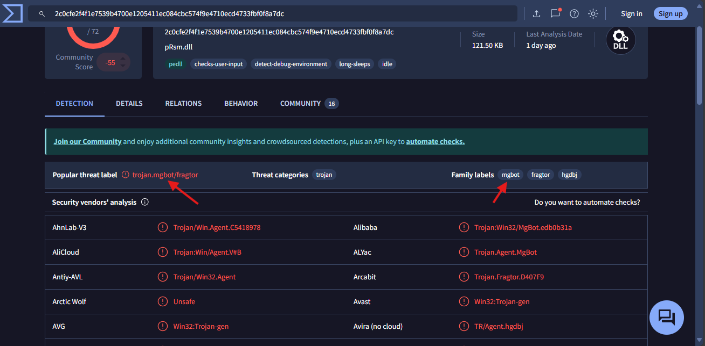

# Friday Overtime
1. *Who shared the malware samples?*
```
Answer: Oliver Bennett
```
Solution: Tương đối đơn giản, chỉ việc mở thư ra là biết được ai là người gửi mẫu mã độc này.
&nbsp;
2. *What is the SHA1 hash of the file "pRsm.dll" inside samples.zip?*
```
Answer: 9d1ecbbe8637fed0d89fca1af35ea821277ad2e8
```
Solution: Tải về và giải nén file `pRsm.dll` với mật khẩu đã được cho trong email. Sau đó mở terminal và chạy lệnh và lấy kết quả:
```
$ sha1sum pRsm.dll
```

&nbsp;
3. *Which malware framework utilizes these DLLs as add-on modules?*
```
Answer: MgBot
```
Solution: Ta mang mã băm vừa tìm được vào `VirusTotal` và tìm kiếm. Kết quả trả về cho ta biết đây là một module của `MgBot`.

&nbsp;
4. *Which MITRE ATT&CK Technique is linked to using pRsm.dll in this malware framework?*
```
Answer: T1123
```
Solution: Tìm một bài báo có viết về MgBot. Tại đó tìm đến file `pRsm.dll` là sẽ thấy tên của kỹ thuật MITRE ATT&CK Technique là `T1123`.

&nbsp;
5. *What is the CyberChef defanged URL of the malicious download location first seen on 2020-11-02?*
```
Answer: hxxp[://]update[.]browser[.]qq[.]com/qmbs/QQ/QQUrlMgr_QQ88_4296[.]exe
```
Solution: Tìm trong bài báo với ngày `2020‑11‑02`, ta sẽ thấy một đường dẫn đến một file `exe` độc hại. Đường dẫn này có dạng `http://update.browser.qq[.]com/qmbs/QQ/QQUrlMgr_QQ88_4296.exe`. Ta chỉ cần defang lại với `CyberChef` là được.

&nbsp;
6. *What is the CyberChef defanged IP address of the C&C server first detected on 2020-09-14 using these modules?*
```
Answer: 122[.]10[.]90[.]12
```

7. *What is the SHA1 hash of the spyagent family spyware hosted on the same IP targeting Android devices on November 16, 2022?*
```
Answer: 1c1fe906e822012f6235fcc53f601d006d15d7be
```
Solution: Tìm kiếm trên `VirusTotal` với IP `122.10.90.12` rồi sau đó sang mục `RELATIONS` và tìm đến `android`, ấn vào name có mã băm `1c1fe906e822012f6235fcc53f601d006d15d7be`.

Mã băm `SHA1` là kết quả cần tìm.
