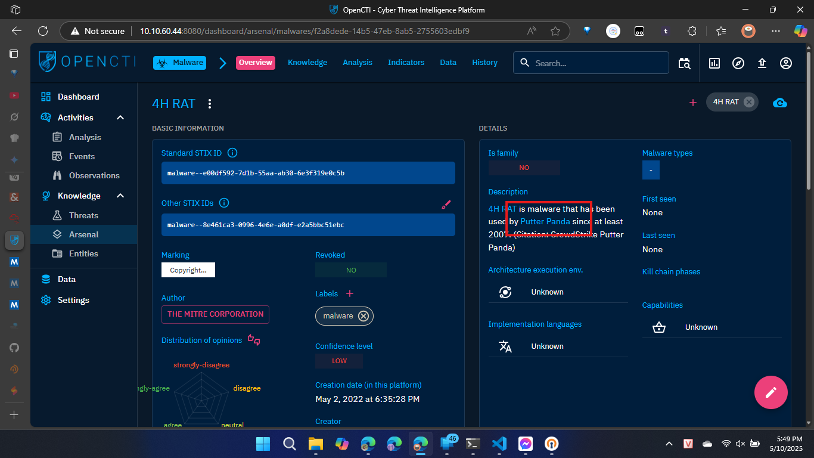
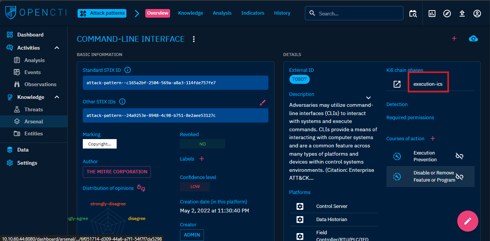
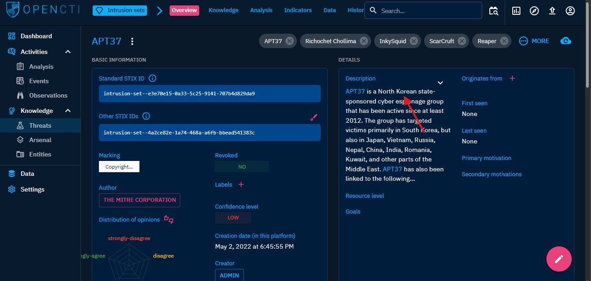

# OpenCTI
# Task 1: Room Overview

# Task 2: Introduction to OpenCTI
**OpenCTI** là một nền tảng mã nguồn mở được thiết kế để cung cấp các tổ chức các phương tiện quản lý *CTI* thông qua việc lưu trữ, phân tích, trực quan hóa và bày các chiến dịch đe dọa, phần mềm độc hại.
**Objective** Do *ANSSI* phát triển, đây là công cụ toàn diện để khai thác và liên kết thông tin tình báo mối đe dọa, hỗ trợ *MITRE ATT&CK* và tích hợp với *MISP/TheHive*.

# Task 3: OpenCTI Data Model
**OpenCTI** sử dụng chủ yếu tiêu chuẩn *STIX2* để cấu trúc dữ liệu tình báo mối đe dọa dưới dạng các thực thể và mối quan hệ. Các dịch vụ nổi bật bao gồm:
- **GraphQL API**: Cung cấp một giao diện lập trình ứng dụng mạnh mẽ cho phép người dùng tương tác với dữ liệu trong OpenCTI.
- **Connectors**: Các trình kết nối cho phép tích hợp với các nguồn dữ liệu bên ngoài, làm giàu thông tin tình báo và xuất dữ liệu đến các hệ thống khác.
- **Write Workers**: Các tiến trình ghi dữ liệu cho phép nhập và xử lý dữ liệu trong OpenCTI.
# Task 4: OpenCTI Dashboard 1
- login vào OpenCTI với địa chỉ, tài khoản, mật khẩu được cung cấp.
1. *What is the name of the group that uses the 4H RAT malware?*
```
Answer: Putter Panda
Solution: Tìm kiếm `4H RAT` trong mục Arsenal. Bấm xem chi tiết là sẽ thấy tên group là `Putter Panda`.
```

2. *What kill-chain phase is linked with the Command-Line Interface Attack Pattern?*
``` 
Answer: Execution-ics
Solution: Vào mục Arsenal > Attack patterns, tìm kiếm `Command-Line Interface Attack Pattern`, bấm vào xem chi tiết sẽ thấy được kill-chain phase là `Execution-ics`.
```

3. *Within the Activities category, which tab would house the Indicators?*
```
Answer: Observations
```
# Task 5: OpenCTI Dashboard 2
1. *What Intrusion sets are associated with the Cobalt Strike malware with a Good confidence level? (Intrusion1, Intrusion2)*
```
Answer: CopyKittens, FIN7
Solution: Vào mục *Arsenal* > *Malware*, tìm kiếm `Cobalt Strike`, Chọn mục *knowledge* > *Intrusion sets*, chọn lọc theo *CONFIDENCE* ta sẽ thấy 2 mục *GOOD* là `CopyKittens, FIN7`.
``` 
2. *Who is the author of the entity?*
```
Answer: The MITRE Corporation
```
# Task 6: OpenCTI Dashboard 3
1. *What is the earliest date recorded related to CaddyWiper?  Format: YYYY/MM/DD*
```
Answer: 2022/03/15
```
2. *Which Attack technique is used by the malware for execution?*
```
Answer: Native API
```
3. *How many malware relations are linked to this Attack technique?*
```
Answer: BloodHound, Empire, ShimRatReporter
```
1. *What country is APT37 associated with?*
```
Answer: North Korea
Solution: Vào mục *Threats* > *Intrusion sets*, tìm kiếm `APT37`, Sẽ thấy được quốc gia là `North Korea`.
``` 

1. *Which Attack techniques are used by the group for initial access? (Ans: Technique1, Technique2)*
```
Answer: T1189, T1566
Solution: Vẫn ở trang câu trước. Chọn mục *knowledge* > *Global kill chain*, kéo xuống tìm *Initial Access* ta sẽ thấy 2 mục là `T1189, T1566`.
```