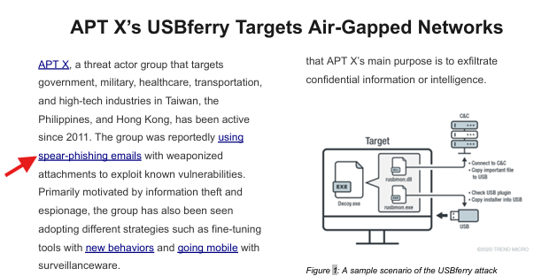

# Tropic trooper
# Answer the questions
1. *What kind of phishing campaign does APT X use as part of their TTPs?*
```
Answer: spear-phishing emails
```

&nbsp;
2. *What is the name of the malware used by APT X?*
```
Answer: USBferry
```

&nbsp;
3. *What is the malware's STIX ID?*
```
Answer: malware--5d0ea014-1ce9-5d5c-bcc7-f625a07907d0
```

&nbsp;
4. *With the use of a USB, what technique did APT X use for initial access?*
```
Answer: Replication through removable media
```
Solution:

Vào mục knowledge > attack patterns > kéo tìm mục `Initial Access` và đáp án ở ngay bên dưới
&nbsp;
5. *What is the identity of APT X?*
```
Answer: Tropic Trooper
```

6. *On OpenCTI, how many Attack Pattern techniques are associated with the APT?*
```
Answer: 39
```

Solution: Vì ta đã biết APT là `Tropic Trooper` nên ta chỉ tìm kiếm trong *Threats > Intrusion Sets > Tropic Trooper > knowledge*
7. *What is the name of the tool linked to the APT?*
```
Answer: BITSAdmin
```

Solution: Vào phần *tools* sẽ thấy ngay `BITSAdmin`
&nbsp;
8. *Load up the Navigator. What is the sub-technique used by the APT under Valid Accounts?*
```
Answer: Local Accounts
```

Solution: Ở mục này ta vào *Mitre ATT&CK* để dễ tìm nhé. Cũng tìm với từ khóa `Tropic Trooper` rồi sử dụng `Ctrl + F` để tìm nhanh hơn
&nbsp;
9. *Under what Tactics does the technique above fall?*
```
Answer: Initial Access, Persistence,  Defense Evasion and Privilege Escalation
```

Solution: Ta vào luôn `T1078.003` sẽ thấy luôn tactics của nó
&nbsp;
10. *What technique is the group known for using under the tactic Collection?*
```
Answer: Automated Collection
```
