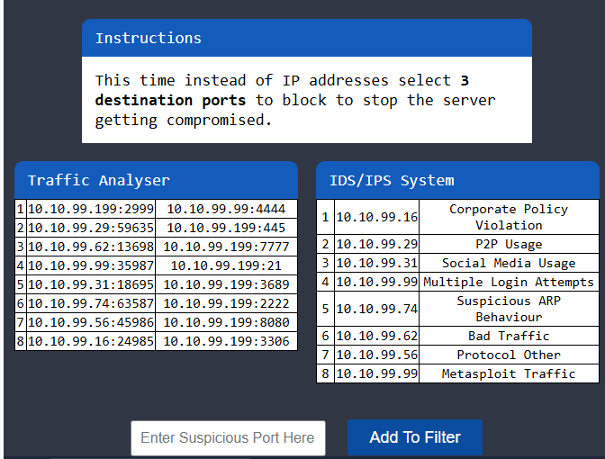

# Traffic Analysis Essentials
# Task 1: Introduction
**Network Security** là một tập hợp các hoạt động để bảo vệ dữ liệu, ứng dụng, thiết bị và hệ thống được kết nối với mạng. Nó được chấp nhận là một trong những tên miền phụ quan trọng của an ninh mạng.
&nbsp;
# Task 2: Network Security and Network Data
## Network Security
Mối quan tâm thiết yếu của An ninh mạng tập trung vào hai khái niệm cốt lõi: **authentication** (xác thực) và **authorization** (ủy quyền).
&nbsp;
**Có 3 cấp độ kiểm soát bảo mật mạng:**
- **Physical:** Kiểm soát bảo mật vật lý ngăn chặn truy cập vật lý trái phép vào các thiết bị mạng, bảng cáp, ổ khóa và tất cả các thành phần được liên kết.
- **Technical:** Kiểm soát bảo mật dữ liệu ngăn chặn truy cập trái phép vào dữ liệu mạng, như cài đặt đường hầm và triển khai các lớp bảo mật.
- **Administrative:** Kiểm soát bảo mật quản trị cung cấp tính nhất quán trong các hoạt động bảo mật như tạo chính sách, cấp độ truy cập và quy trình xác thực.
Có hai cách tiếp cận chính cấp độ kiểm soát này:

|   Access Control   |   Threat Control   |
|----------|----------|
| Điểm khởi đầu của Network Security. Nó là một tập hợp các biện pháp kiểm soát để đảm bảo xác thực và ủy quyền.|Phát hiện và ngăn chặn các hoạt động bất thường/độc hại trên mạng. Nó chứa cả đầu dò dữ liệu lưu lượng truy cập bên trong (đáng tin cậy) và bên ngoài.

&nbsp;
**Các yếu tố chính của Kiểm soát truy cập:**
|Yếu tố|Mô tả|
|----------|----------|
|**Firewall Protection**|Kiểm soát lưu lượng mạng đến và đi với các quy tắc bảo mật được xác định trước. Được thiết kế để chặn lưu lượng truy cập đáng ngờ/độc hại và các mối đe dọa lớp ứng dụng trong khi cho phép lưu lượng truy cập hợp pháp và dự kiến.|
|**Network Access Control (NAC)**|Kiểm soát sự phù hợp của các thiết bị trước khi truy cập vào mạng. Được thiết kế để xác minh các thông số kỹ thuật và điều kiện của thiết bị tuân thủ cấu hình được xác định trước trước khi kết nối với mạng.|
|**Identity and Access Management (IAM)**|Kiểm soát và quản lý danh tính tài sản cũng như quyền truy cập của người dùng vào hệ thống dữ liệu và tài nguyên qua mạng.|
|**Load Balancing**|Kiểm soát việc sử dụng tài nguyên để phân phối các tác vụ (dựa trên số liệu) trên một tập hợp tài nguyên và cải thiện luồng xử lý dữ liệu tổng thể.|
|**Network Segmentation**|Tạo và kiểm soát phạm vi và phân đoạn mạng để cách ly mức độ truy cập của người dùng, nhóm tài sản có chức năng chung và cải thiện khả năng bảo vệ các thiết bị/dữ liệu nhạy cảm/nội bộ trong một mạng an toàn hơn.|
|**Virtual Private Networks (VPN)**|Tạo và kiểm soát giao tiếp được mã hóa giữa các thiết bị (thường để truy cập từ xa an toàn) qua mạng (bao gồm cả giao tiếp qua internet).|
|**Zero Trust Model**|Đề xuất định cấu hình và triển khai quyền truy cập và quyền ở mức tối thiểu (cung cấp quyền truy cập cần thiết để hoàn thành vai trò được chỉ định). Tư duy tập trung vào: "Đừng bao giờ tin tưởng, hãy luôn xác minh".

**Các yếu tố chính của Kiểm soát mối đe dọa:**
|Yếu tố|Mô tả|
|----------|----------|
|**Intrusion Detection and Prevention (IDS/IPS)**|Kiểm tra lưu lượng truy cập và tạo cảnh báo (IDS) hoặc đặt lại kết nối (IPS) khi phát hiện sự bất thường/mối đe dọa.
|**Data Loss Prevention (DLP)**|Kiểm tra lưu lượng (thực hiện kiểm tra nội dung và phân tích theo ngữ cảnh của dữ liệu trên dây) và chặn việc trích xuất dữ liệu nhạy cảm.
|**Endpoint Protection**|Bảo vệ tất cả các loại thiết bị đầu cuối và thiết bị kết nối với mạng bằng cách sử dụng phương pháp tiếp cận nhiều lớp như mã hóa, chống vi-rút, phần mềm chống phần mềm độc hại, DLP và IDS/IPS.
|**Cloud Security**|Bảo vệ tài nguyên hệ thống dựa trên đám mây/trực tuyến khỏi các mối đe dọa và rò rỉ dữ liệu bằng cách áp dụng các biện pháp đối phó phù hợp như VPN và mã hóa dữ liệu.
|**Security Information and Event Management (SIEM)**|Công nghệ giúp phát hiện mối đe dọa, tuân thủ và quản lý sự cố bảo mật thông qua dữ liệu có sẵn (nhật ký và thống kê lưu lượng truy cập) bằng cách sử dụng phân tích sự kiện và bối cảnh để xác định các điểm bất thường, mối đe dọa và lỗ hổng.
|**Security Orchestration Automation and Response (SOAR)**|Công nghệ giúp phối hợp và tự động hóa các tác vụ giữa nhiều người, công cụ và dữ liệu khác nhau trong một nền tảng duy nhất để xác định các điểm bất thường, mối đe dọa và lỗ hổng. Nó cũng hỗ trợ quản lý lỗ hổng, ứng phó sự cố và các hoạt động bảo mật.
|**Network Traffic Analysis & Network Detection and Response**|Kiểm tra lưu lượng truy cập mạng hoặc thu thập lưu lượng truy cập để xác định các điểm bất thường và mối đe dọa.
&nbsp;

**Hoạt động quản lý bảo mật mạng điển hình được giải thích trong bảng đã cho:**
| Deployment| Configuration| Management| Monitoring| Maintenance|
|--------|----------|----------|---------|------------|
| • Cài đặt thiết bị và phần mềm<br>• Cấu hình ban đầu<br>• Tự động hóa | • Cấu hình tính năng<br>• Cấu hình truy cập mạng ban đầu | • Triển khai chính sách bảo mật<br>• Triển khai NAT và VPN<br>• Giảm thiểu mối đe dọa | • Giám sát hệ thống<br>• Giám sát hoạt động người dùng<br>• Giám sát mối đe dọa<br>• Thu thập log và mẫu lưu lượng | • Nâng cấp<br>• Cập nhật bảo mật<br>• Điều chỉnh quy tắc<br>• Quản lý giấy phép<br>• Cập nhật cấu hình
&nbsp;

## Managed Security Services
Do hạn chế về nguồn lực (ngân sách, kỹ năng, quy mô), các tổ chức thuê Dịch vụ An ninh Quản lý (**MSS**) từ các nhà cung cấp (*MSSP*). **MSS** giúp đáp ứng và tăng cường nhu cầu bảo mật một cách hiệu quả về thời gian, chi phí và dễ quản lý.

| Dịch vụ| Mô tả|
|-----------|----------|
| **Network Penetration Testing** | Đánh giá an ninh mạng bằng cách mô phỏng các kỹ thuật của kẻ tấn công bên ngoài/bên trong để xâm nhập mạng.|
| **Vulnerability Assessment** | Đánh giá an ninh mạng bằng cách phát hiện và phân tích các lỗ hổng trong môi trường.|
| **Incident Response** | Một phương pháp tiếp cận có tổ chức để giải quyết và quản lý một vi phạm an ninh. Nó bao gồm một tập hợp các hành động để xác định, ngăn chặn và loại bỏ các sự cố.|
| **Behavioural Analysis** | Một phương pháp tiếp cận có tổ chức để giải quyết các hành vi của hệ thống và người dùng, tạo đường cơ sở và hồ sơ lưu lượng cho các mẫu cụ thể nhằm phát hiện sự bất thường, mối đe dọa, lỗ hổng và các cuộc tấn công.|

## Answer the questions
1. *Which Security Control Level covers contain creating security policies?*
```
Answer: Administrative
```
2. *Which Access Control element works with data metrics to manage data flow?*
```
Answer: Load Balancing
```
3. *Which technology helps correlate different tool outputs and data sources?*
```
Answer: SOAR
```
# Task 3: Traffic Analysis
## Traffic Analysis / Network Traffic Analysis
Phân tích lưu lượng mạng là giám sát và phân tích dữ liệu mạng để phát hiện sự cố (vận hành, bảo mật) và các mối đe dọa.

**Có hai kỹ thuật chính được sử dụng trong Phân tích lưu lượng truy cập là:**

| Flow Analysis| Packet Analysis|
|-----------|--------------|
| Thu thập dữ liệu/bằng chứng từ các thiết bị mạng. Loại phân tích này nhằm cung cấp kết quả thống kê thông qua tóm tắt dữ liệu mà không cần điều tra sâu ở cấp độ gói tin. | Thu thập tất cả dữ liệu mạng có sẵn. Áp dụng điều tra sâu ở cấp độ gói tin (thường được gọi là Deep Packet Inspection (DPI)) để phát hiện và chặn các gói tin bất thường và độc hại. |
| • **Ưu điểm:** Dễ dàng thu thập và phân tích.| • **Ưu điểm:** Cung cấp chi tiết gói tin đầy đủ để tìm ra nguyên nhân gốc rễ của một trường hợp.|
| • **Thách thức:** Không cung cấp chi tiết gói tin đầy đủ để tìm ra nguyên nhân gốc rễ của một trường hợp.| • **Thách thức:** Yêu cầu thời gian và bộ kỹ năng để phân tích.|

**Lợi ích của việc phân tích lưu lượng mạng:**
- Cung cấp một cái nhìn tổng quan về lưu lượng mạng.
- Giúp xây dựng cơ sở toàn diện để theo dõi tài sản.
- Giúp phát hiện/ứng phó với những bất thường và mối đe dọa.

## Answer the questions
1. *Level-1 is simulating the identification and filtering of malicious IP addresses.*
*What is the flag?*
```
Answer: THM{PACKET_MASTER}
```
Solution: Block 2 địa chỉ IP là `10.10.99.99` và `10.10.99.62`

2. *Level-2 is simulating the identification and filtering of malicious IP and Port addresses.*
*What is the flag?*
```
Answer: THM{DETECTION_MASTER}
```
Solution: Ở đây bài yêu cầu tìm ra 3 cổng đích nguy hiểm, mình sẽ `7777`, `2222` và `4444`. 
