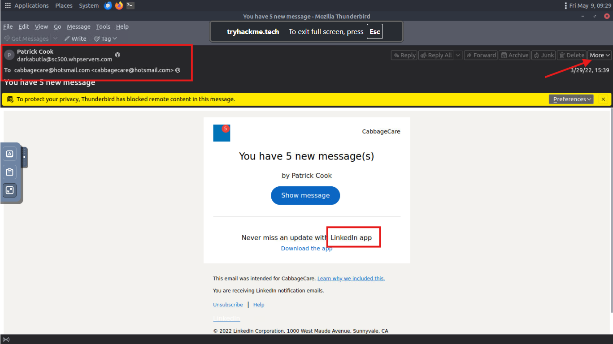
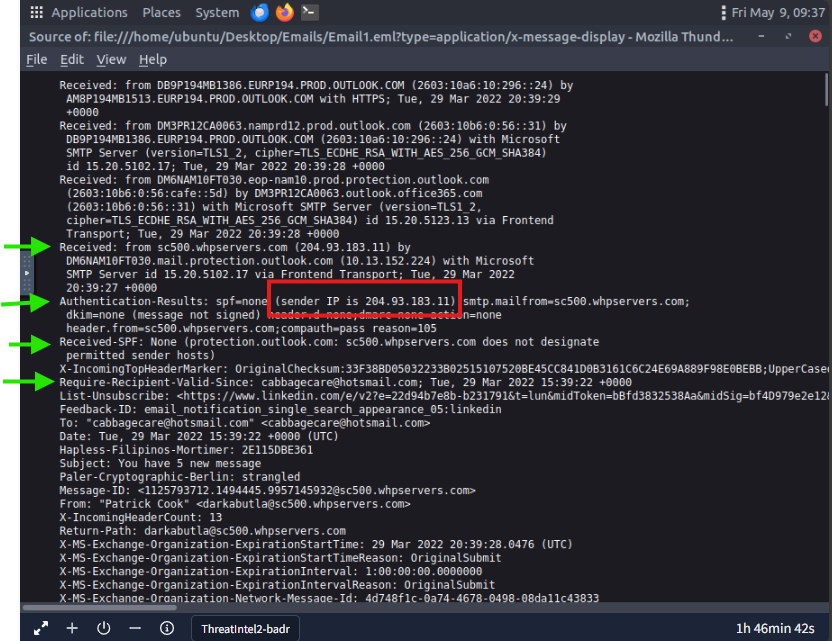
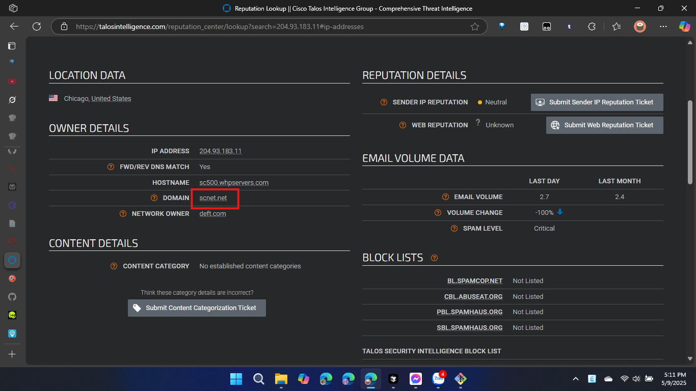
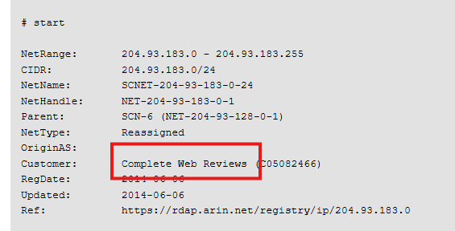
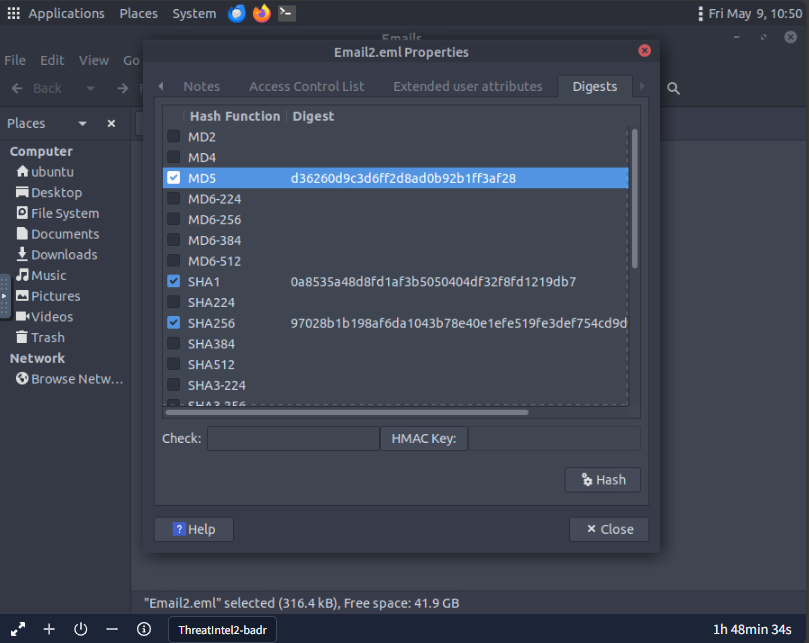
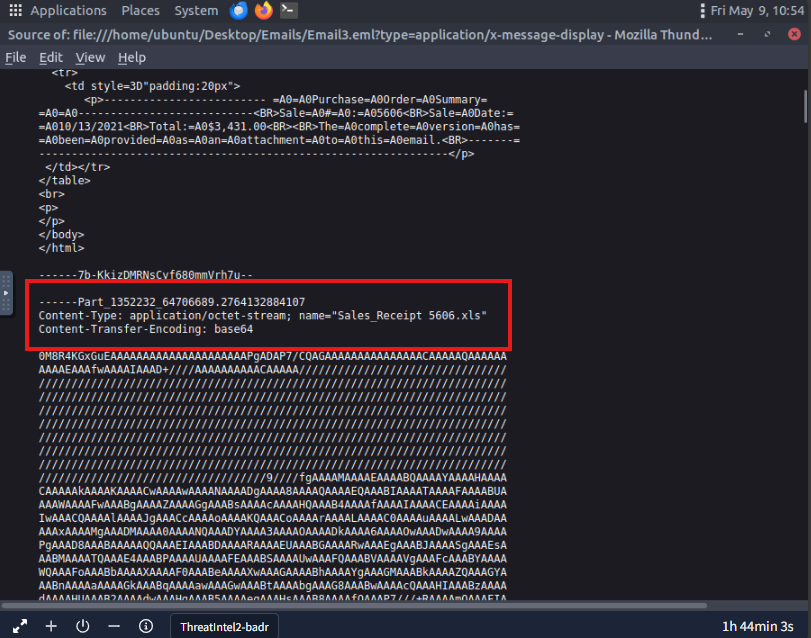
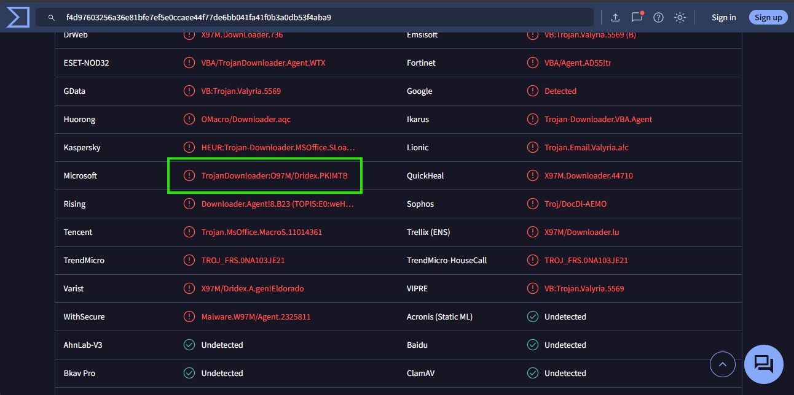

# Task 1: Room outline
## Overview
- Phòng này sẽ đề cập đến Threat Intelligence và một công cụ số mã nguồn mở hữu ích.

# Task 2: Threat Intelligence
## Overview
- Để giảm thiểu mối đe dọa, hãy cố gắng trả lời các câu hỏi sau:
  - Ai đang tấn công bạn?
  - Động lực của họ là gì?
  - Họ có khả năng làm gì?
  - Các tạo tác và và dấu hiệu nào mà bạn cần chú ý?

## Threat Intelligence Classifications:
- Bạn có thể phân loại mối đe dọa thành **4** loại:
  - **Strategic Intel**: Chiến lược
  - **Technical Intel**: Kỹ thuật
  - **Tactical Intel**: Chiến thuật
  - **Operational Intel**: Hoạt động

# Task 3: UrlScan.io
## Overview
- **UrlScan.io** là một công cụ trực tuyến miễn phí cho phép bạn quét và phân tích URL. Trang web này cung cấp **2** chế độ xem:
  - **Scan results**: Xem kết quả quét URL
    - **Summary**: Tổng quan về URL
    - **HTTP**: Thông tin HTTP
    - **Redirects**: Thông tin chuyển hướng
    - **Links**: Thông tin liên kết
    - **Behaviors**: Thông tin hành vi
    - **Indicators**: Thông tin dấu hiệu
  - **Scenarios**: Xem các tình huống thực tế mà URL đã được sử dụng

## Answer the questions
Sử dụng ảnh để trả lời các câu hỏi:

1. *What was TryHackMe's Cisco Umbrella Rank based on the screenshot?*
Answer: **345612**
2. *How many domains did UrlScan.io identify on the screenshot?*
Answer: **13**
3. *What was the main domain registrar listed on the screenshot?*
Answer: **NAMECHEAP INC**
4. *What was the main IP address identified for TryHackMe on the screenshot?*
Answer: **2606:4700:10::ac43:1b0a**

# Task 4: Abuse.ch
## Understanding Abuse.ch
- **Abuse.ch** là một dự án nghiên cứu bởi viện an ninh mạng và kỹ thuật của trường đại học khoa học ứng dụng Bern ở Thụy Sĩ. Những nền tảng này bao gồm: **Malware Bazaar**, **Feodo Tracker**, **SSL Blacklist**, **URLhaus**, **Threat Fox**
- **Malware Bazaar**: Tập hợp dữ liệu về malware. Dự án này cung cấp 2 tính năng chính:
  - **Malware Sample Upload**: Tải lên mẫu malware
  - **Malware Hunting**: Tìm kiếm malware
- **Feodo Tracker**: Trong dự án này, mục tiêu của Abuse.ch là chi sẻ thông tin về tấn công botnet Command and Control (C&C) server và cũng liên quan tới Dridex, Emotet , Qakbot, TrickBot, Ursnif, BazarLoader/BazarBackdoor và nhiều hơn nữa.
- **SSL Blacklist**: **Abuse.ch** phát triển công cụ này để xác định lỗ hổng kết nối SSL. 
- **URLhaus**: Như tên dự án, công cụ này tập trung vào việc chia sẻ URLs độc hại.
- **Threat Fox**: Với **Threat Fox**, phân tích viên có thể tìm kiếm, chia sẻ và xuất các dấu hiệu liên quan đến phần mềm độc hại

## Answer the questions
1. *The IOC 212.192.246.30:5555 is identified under which malware alias name on ThreatFox?*
Answer: **Katana**
Solution: **Tìm kiếm với từ khóa "ioc:212.192.246.30:5555"**
2. *Which malware is associated with the JA3 Fingerprint **51c64c77e60f3980eea90869b68c58a8** on SSL Blacklist?*
Answer: **Dridex**
Solution: **Tìm kiếm với từ khóa "ja3:51c64c77e60f3980eea90869b68c58a8"**
3. *From the statistics page on URLHaus, what malware-hosting network has the ASN number AS14061?*
Answer: **DIGITALOCEAN-ASN**
Solution: **Tìm kiếm với từ khóa "asn:14061"**
4. *Which country is the botnet IP address 178.134.47.166 associated with according to FeodoTracker?*
Answer: **Georgia**
Solution: **Tìm kiếm với từ khóa "ip:178.134.47.166"**

# Task 5: PhishTool
## PhishTool Overview
- **Email phising** là một trong những tiền thân của tấn công mạng. Người dùng không nghi ngờ sẽ bị lừa mở và truy cập tệp và liên kết đính kèm. Kết quả là kẻ tấn công có thể lây nhiễm malware vào hệ thống của bạn.
- **PhishTool** tìm cách nâng cao nhân thức về lừa đảo như một tấn công nghiêm trọng và cung cấp phương tiện bảo mật email. Thông qua phân tích email, các phân tích viên có thể phát hiện ra IOC email, ngăn chặn vi phạm và cung cấp các pháp y có thể được sử dụng trong các hoạt động huấn luyện và ngăn chặn lừa đảo.
- **PhishTool**: có hai phiên bản có thể truy cập được: **Community** và **Enterprise**. Và tính năng chính sẽ bao gồm:
  - **Perform email analysis**: Phân tích email
  - **Heuristic intelligence**: Thông tin hành vi
  - **Classsification and reporting**: Phân loại và báo cáo
- **Analysis tab**: Sau khi tải lên, email được phân tích chi tiết với các tab sau:
  - **Headers**: Thông tin định tuyến (địa chỉ email nguồn/đích, IP gốc, DNS, thời gian).
  - **Received Lines**: Quá trình truyền email qua các máy chủ SMTP để truy vết.
  - **X-headers**: Tiêu đề mở rộng do hộp thư người nhận thêm vào, cung cấp thông tin bổ sung.
  - **Security**: Chi tiết về khung bảo mật email (SPF, DKIM, DMARC).
  - **Attachments**: Danh sách tệp đính kèm trong email.
  - **Message URLs**: Các URL bên ngoài có trong email.
## Answer the questions

1. *What social media platform is the attacker trying to pose as in the email?*

Answer: **LinkedIn**
Solution: **Sau khi mở file lên `Email1.eml` sẽ thấy ngay đang giới thiệu về LinkedIn**
1. *What is the senders email address?*
Answer: **darkabutla@sc500.whpservers.com**
Solution: **Cũng sẽ thấy được tên người gửi trong trang đầu tiên sau khi mở file lên `Email1.eml`**
2. *What is the recipient's email address?*
Answer: **cabbagecare@hotsmail.com**
Solution: **Cũng sẽ thấy được tên người nhận trong trang đầu tiên sau khi mở file lên `Email1.eml`**
3. *What is the Originating IP address? Defang the IP address.*
Answer: **104.237.130.10**
Solution: **Sau khi mở file lên `Email1.eml` sẽ thấy ngay IP gốc**
4. *What is the Originating IP address? Defang the IP address.*
Answer: **204[.]93[.]183[.]11**
Solution: **Ấn vào more > view source ở góc phải trên cùng của màn hình để xem chi tiết về file. Lúc này màn hình sẽ hiện ra**

- Như khung đỏ được đánh dấu trong hình trên, ta có thể thấy được IP gốc của email. Nhưng để có đáp án đúng so với mong đợi, thì cần phải chuyển địa chỉ IP thành dạng defanged IP. Ta có thể sử dụng các mã nguồn mở, khuyến khích dùng `CyberChef` để làm việc này.
5. **How many hops did the email go through to get to the recipient?**
Answer: **4**
Solution: **Sử dụng hình ảnh của câu trên, ta cũng có thể thấy được số lượng bước mà email đã đi qua bao gồm: Require-Recipient-Valid-Since, Received-SPF, Authentication-Results, Received**
# Task 6: Cisco Talos Intelligence
## Cisco Talos Overview
- **Cisco Talos** là nhóm chuyên gia an ninh mạng của Cisco, tập hợp dữ liệu từ sản phẩm để cung cấp thông tin tình báo, phát hiện và bảo vệ trước các mối đe dọa mới. Giải pháp được gọi là **Talos Intelligence**. Gồm các đội chính:
  - **Threat Intelligence & Interdiction**: Phân tích và theo dõi mối đe dọa, chuyển đổi IOCs thành thông tin chi tiết.
  - **Detection Research**: Nghiên cứu lỗ hổng và mã độc để tạo quy tắc phát hiện mối đe dọa.
  - **Engineering & Development**: Duy trì và cập nhật công cụ kiểm tra để phát hiện mối đe dọa mới.
  - **Vulnerability Research & Discovery**: Hợp tác với nhà cung cấp để phát hiện và báo cáo lỗ hổng bảo mật.
  - **Communities**: Quản lý hình ảnh đội và các giải pháp mã nguồn mở.
  - **Global Outreach**: Chia sẻ thông tin tình báo qua các ấn phẩm cho khách hàng và cộng đồng an ninh mạng.
- **Talos Dashboard** là giải pháp mã nguồn mở cung cấp giao diện tra cứu danh tiếng (reputation lookup) với bản đồ thế giới. Bản đồ hiển thị tổng quan lưu lượng email toàn cầu, phân loại thành hợp pháp (**legitimate**), thư rác (**spam**), hoặc mã độc (**malware**) tại nhiều quốc gia.
Ở đầu giao diện, Talos Dashboard cung cấp các tab chứa nguồn tài nguyên tình báo khác nhau, bao gồm:
- **Vulnerability Information**:
Báo cáo lỗ hổng đã công bố và zero-day, gắn với mã CVE và điểm CVSS.
  - Chi tiết báo cáo bao gồm: thông tin lỗ hổng, dòng thời gian công bố.
  - Cung cấp thông báo lỗ hổng từ Microsoft và các quy tắc Snort áp dụng.
- **Reputation Center**:
  - Tra cứu dữ liệu mối đe dọa liên quan đến IP và tệp (dựa trên hàm băm SHA256).
  - Hỗ trợ nhà phân tích điều tra mối đe dọa.
- **Tab Email & Spam Data**: Cung cấp thêm dữ liệu về email và thư rác.
## Answer the questions
1. *What is the listed domain of the IP address from the previous task?*
Answer: **scnet.net**
Solution: **Truy cập vào `https://talosintelligence.com/` và tìm kiếm với ip "104.237.130.10"**

2. *What is the listed domain of the IP address from the previous task?*
Answer: **Complete Web Reviews**

- Vì hiện tại Talos không thể xác định được nên mình sẽ sử dụng một trang web ngoài để kiểm tra **WHOIS**.

# Task 7: Scenario 1
## Answer the questions
1. *According to Email2.eml, what is the recipient's email address?*
Answer: **chris.lyons@supercarcenterdetroit.com**
2. **On VirusTotal, the attached file can also be identified by a Detection Alias, which starts with an H.**
Answer: **HIDDENEXT/Worm.Gen**
Solution: **Vì trong máy ảo không thể truy cập mạng nên ta sẽ tìm kiếm bằng hash của file. Chuột phải vào file, chọn properties, sau đó chọn mục Digests. Ấn Hash để lấy hàm băm. Lấy loại hàm băm nào cũng sẽ cho ra kết quả nhé.**

# Task 8: Scenario 2
## Answer the questions
1. *What is the name of the attachment on Email3.eml?*
Answer: **Sales_Receipt 5606.xls**
Solution: **Phần này tương đối dễ, chỉ việc view source của file lên là sẽ thấy**

2. *What malware family is associated with the attachment on Email3.eml?*
Answer: **Dridex**
Solution: **Từ câu hỏi trước ta đã biết được tên file là `Sales_Receipt 5606.xls`. Đây là một dạng file tài liệu, vậy thì ta sẽ bám sát vào dữ liệu này và tìm, lướt đến mục Microsoft ta sẽ thấy tên `Dridex`"**

