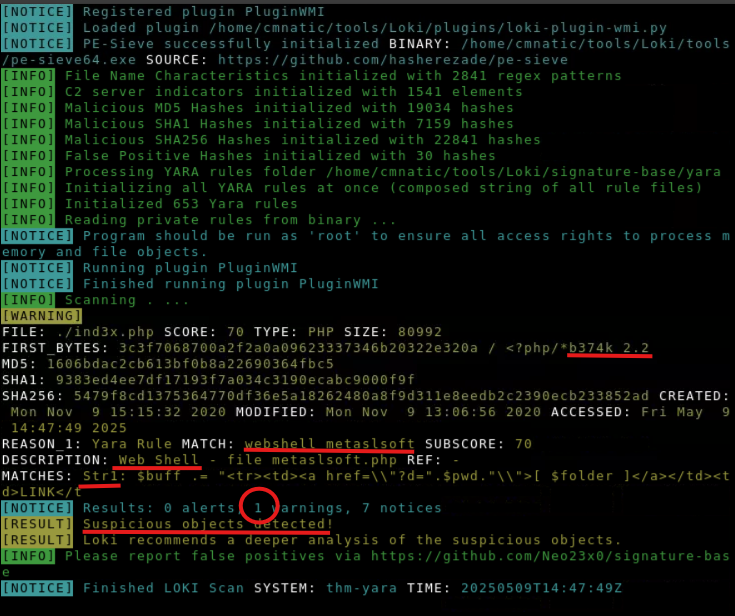

# Yara

# Task 2: What is Yara?
## All about Yara
- **Yara** là công cụ tìm kiếm mẫu (**pattern matching**) mạnh mẽ, dùng để nhận diện thông tin dựa trên mẫu nhị phân (**binary**) và mẫu văn bản (**textual**), như chuỗi **hexadecimal** hoặc chuỗi ký tự trong tệp.
## Quy tắc Yara
- **Yara** sử dụng quy tắc (rules) để gắn nhãn cho các mẫu.
- Ví dụ: **Yara rules** thường được viết để xác định tệp có độc hại hay không dựa trên **đặc điểm** hoặc **mẫu** mà tệp thể hiện.
- **Chuỗi (strings)** là thành phần cơ bản trong lập trình, được ứng dụng dùng để lưu trữ dữ liệu văn bản.

## Tại sao mã độc sử dụng chuỗi?
Giống như ứng dụng thông thường, mã độc sử dụng chuỗi để lưu trữ dữ liệu văn bản. Một số ví dụ dữ liệu mà mã độc lưu trong chuỗi bao gồm:
- Thông tin cấu hình.
- Địa chỉ máy chủ điều khiển (C2).
- Thông điệp lừa đảo hoặc mã hóa.
## Answer the question
1. *What is the name of the base-16 numbering system that Yara can detect?*
Answer: **Hexadecimal**
2. *Would the text "Enter your Name" be a string in an application? (Yay/Nay)*
Answer: **Yay**

# Task 3: Deploy
## In-Browser (No  VPN required)
Phần này chỉ cần chạy máy trực tiếp trên Web nên không có gì để nói
## Using SSH (TryHackMe VPN required).
Phần này cần cài đặt OpenVPN trên máy và tải file config từ TryHackMe. Mở file bằng OpenVPN Client và chọn **Connect**. Thử vào terminal và gõ lệnh:
```
Format: ssh username@ip_address
Example: ssh cmnatic@10.10.69.148
```
Sau đó sẽ yêu cầu nhập `password` và nhập vào là được.
# Task 4: Introduction to Yara Rules
## Tạo Quy tắc Yara Đầu tiên
Ngôn ngữ độc quyền của Yara dùng để viết quy tắc khá dễ học nhưng khó thành thạo, vì hiệu quả của quy tắc phụ thuộc vào hiểu biết về mẫu bạn muốn tìm kiếm.
## Cách sử dụng lệnh Yara
Mỗi lệnh yara cần hai tham số:
- Tệp quy tắc (rule file).
- Tên tệp, thư mục hoặc ID tiến trình (PID) để áp dụng quy tắc.

## Expanding on Yara Rules
- **Yara rules** có thể được viết bằng ngôn ngữ YARA hoặc bằng ngôn ngữ bản đồ (map language).
- Ngôn ngữ bản đồ (map language) là ngôn ngữ được sử dụng để viết quy tắc YARA.
- Ngôn ngữ bản đồ (map language) là ngôn ngữ được sử dụng để viết quy tắc YARA.
- Ngôn ngữ bản đồ (map language) là ngôn ngữ được sử dụng để viết quy tắc YARA.

# Task 5: Expanding on Yara Rules
Yara hỗ trợ tìm kiếm mẫu phức tạp hơn việc kiểm tra tệp tồn tại, thông qua các thành phần chính:
- **Meta**: Lưu thông tin mô tả (như mô tả quy tắc), không ảnh hưởng đến quy tắc.
- **Strings**: Tìm kiếm chuỗi văn bản hoặc hexadecimal (ví dụ: "Hello World!"). Quy tắc có thể tìm nhiều chuỗi với điều kiện any of them (ví dụ: "hello world", "HELLO WORLD").
- **Conditions**: Sử dụng toán tử (`<=`, `>=`, `!=`) và từ khóa (and, or, not) để kết hợp điều kiện. Ví dụ: kiểm tra chuỗi "Hello World!" và kích thước tệp <10KB.

# Task 6: Yara Modules
**Yara** có thể được cải tiến đáng kể khi tích hợp với **Cuckoo Sandbox** và **Python PE Module**, nâng cao khả năng phân tích mã độc.

# Task 7: Other tools and Yara
Bên cạnh **Yara tool** thì cũng có các công cụ hữu ích khác như **LOKI, THOR, FENRIR, YAYA.**

# Task 8: Using LOKI and its Yara rule set

1. *Scan file 1. Does Loki detect this file as suspicious/malicious or benign?*
Answer: **Suspicious**
2. *What Yara rule did it match on?*
Answer: **webshell_metaslsoft**
3. *What does Loki classify this file as?*
Answer: **Web Shell**
4. *Based on the output, what string within the Yara rule did it match on?*
Answer: **Str1**
5. *What is the name and version of this hack tool?*
Answer: **b374k 2.2**
6. *Inspect the actual Yara file that flagged file 1. Within this rule, how many strings are there to flag this file?*
Answer: **1**
7. *Scan file 2. Does Loki detect this file as suspicious/malicious or benign?*
Answer: **Benign**
8. *Inspect file 2. What is the name and version of this web shell?*
Answer: **b374k 3.2.3**
Solution: **Mở file 1ndex.php bằng vi/nano để xem vì đây là một file lành tính**

# Task 9: Creating Yara rules with yarGen
